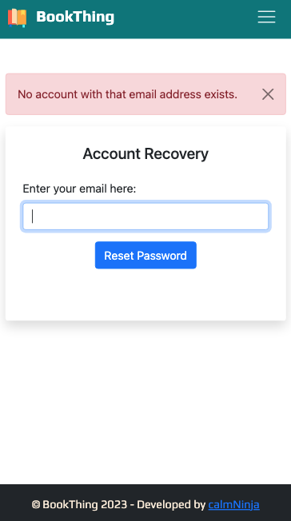
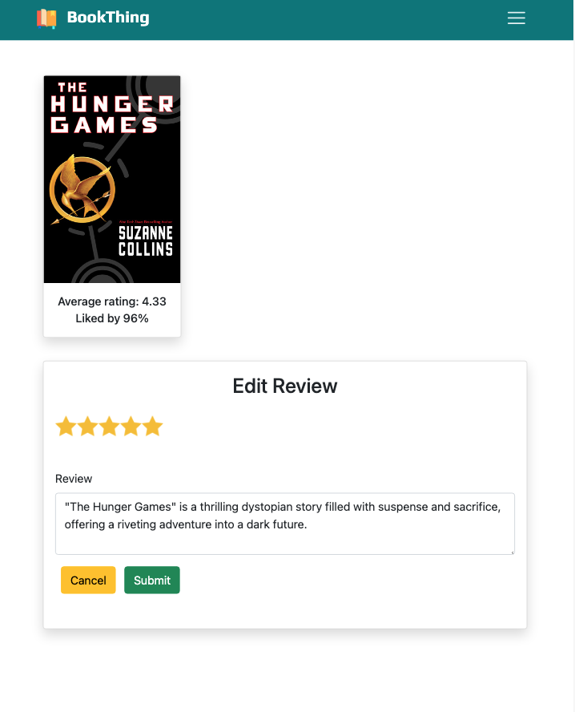

<!-- # BookThing - A Book Review App -->

<div align="center">
  <h1 style="color: white; background-color:#00ab66; font-size: 36px; padding:10px">BookThing - A Book Review App</h1>
</div>

BookThing is a full-stack web application built with HTML, CSS, Bootstrap, Vanilla JavaScript, Node.js, EJS (Embedded JavaScript), and Express, using MongoDB for data storage. It's hosted on MongoDB Atlas and deployed on Render, with a responsive design for an optimal user experience on all devices.

## Table of Contents

- [Features](#⭐-features)
- [Live Demo](#🚀-live-demo)
- [Screenshots](#📸-screenshots)
- [Installation](#🔧-installation)
- [Attribution](#📜-attribution)

## &#x2B50; Features

- **Book Gallery:** Discover popular titles with ratings and reviews.

- **Search Bar:** Perform live searches for books.

- **User Registration:** Register with email, password, and additional information. Optional avatar selection with a default option. Admin code for admin access.

- **User Authentication:** Authentication ensures that only registered users can access the app's features.

- **User Profiles:** Displays user information with books read count, 'Read' bookshelf, Reviews posted and options to edit/delete their account.

- **Book Management:** Users can add or remove books they have read to/from their bookshelf.

- **Book Reviews:** Users can rate and review books they've read. A book cannot be reviewed until it's marked as 'Read.' Users can edit/delete their reviews.

- **Account Deletion:** Option to delete your account.

- **User Interaction:** View other users' profiles. However, users cannot edit other users' profiles.

- **Admin Privileges:** Special privileges for book and user data management.

- **Password Management:** Change Password or Reset forgotten passwords securely with email confirmation.

## &#x1F680; Live Demo

Check out a live demo of the app [here](https://bookthingapp-tvpg.onrender.com/)

## &#x1F4F8; Screenshots

<div align="center">
  <p><strong>Home Page</strong></p>
  
</div>
<br>
<div align="center">
  <p><strong>Book Gallery</strong></p>
  
</div>
<br>
<div align="center">
  <p><strong>Live Search</strong></p>
  
</div>
<br>
<div align="center">
  <p><strong>User Registration</strong></p>
  
</div>
<br>
<div align="center">
  <p><strong>User Profile</strong></p>
  
</div>
<br>
<div align="center">
  <p><strong>Account Recovery</strong></p>
  
</div>
<br>
<div align="center">
  <p><strong>Edit Review</strong></p>
  
</div>
<br>
<div align="center">
  <p><strong>Admin Priveleges</strong></p>
  
</div>
<br>

## &#x1F527; Installation

To run the app locally, follow these steps:

1. Clone the repository:

   ```bash
   git clone https://github.com/calmNinja/bookThingApp-fullstack.git
   ```

2. Navigate to the project directory.

   ```bash
   cd bookThingApp
   ```

3. Install the required dependencies.

   ```bash
   npm install
   ```

4. Create a .env file in the project root and add

   ```bash
   ADMIN_PASSWORD=your_admin_password
   GMAILPW=your_gmail_password
   DEFAULT_AVATAR_URL=your_default_avatar_url
   DB_URL=your_database_connection_url
   SECRET=your_secret_key
   ```

   Replace your_admin_password, your_gmail_password, your_default_avatar_url, your_database_connection_url, and your_secret_key with your actual values for these environment variables.

5. Start the MongoDB service using the following commands:

   - Start the MongoDB service using Homebrew:

   ```bash
   brew services start mongodb-community@6.0
   ```

   - In another terminal tab, run the MongoDB server:

   ```bash
   mongod
   ```

Ensure these services are running; otherwise, the app won't work correctly.

6. Seed the Database.

   ```bash
   node seeds/index.js
   ```

7. Start the development server.

   ```bash
   npm start
   ```

8. Open your web browser and visit http://localhost:3000

## &#x1F4DC; Attribution

The "best_books_ever.json" dataset was retrieved from this [source](https://github.com/scostap/goodreads_bbe_dataset)

> Lorena Casanova Lozano, & Sergio Costa Planells. (2020). Best Books Ever Dataset (Version 1.0.0) [Data set]. Zenodo. [http://doi.org/10.5281/zenodo.4265096](http://doi.org/10.5281/zenodo.4265096)
